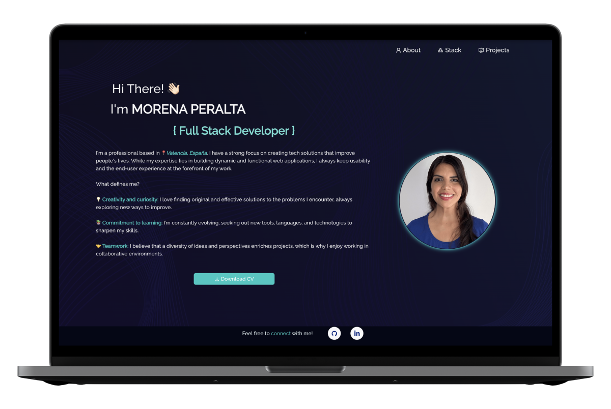

# Personal Portfolio - Morena Peralta

This is my personal portfolio. The website is simple and functional to showcase my skills, the technologies I work with, and the projects I have completed.

## 🚀 Project Overview

The website consists of three main sections:

1. **About**: A page where I share information about myself, my interests, and my experience. You can also download my CV through a button on this page.

2. **Stack**: This section provides details on the technologies I am proficient in as well as the ones I am currently learning.

3. **Projects**: A portfolio of projects I have worked on, each with a link to the repository and a live demo.

## 🖥️ User Interface
<div align="center">
    
</div>

## 🛠️ Technologies Used

<div align="center">
<a href="https://developer.mozilla.org/es/docs/Web/HTML"></a>
<a href="https://developer.mozilla.org/es/docs/Web/CSS"></a>
<a href="https://reactjs.org/"></a>
<a href="https://vitejs.dev/"></a>
<a href="https://pages.github.com/"></a>
</div>

## 🌟 Features

- **Responsive Design**: The website is fully responsive and adapts to different screen sizes.
- **Project Showcase**: Each project includes links to both the repository and the deployed version.

## 📂 Installation and Setup

To run this project locally, follow these steps:

1. Clone the repository:

```git clone https://github.com/More-Pe/MP-Portfolio```

2. Navigate to the project directory.

3. Install dependencies:

```npm install```

4. Start the development server:

```npm run dev```

5. Open your browser and visit http://localhost:5173 to see the portfolio.

## 🚀 Deploy

<div align="center"><h5>To see this page in accion, click here! ⮕ </h5><a href="https://more-pe.github.io/MP-Portfolio/" target="_blank"></a>
</div>

## 📞 Contact

<a href=https://www.linkedin.com/in/morena-peralta-almada target="blank"></a> <a href=https://www.github.com/More-Pe target="blank"></a>
